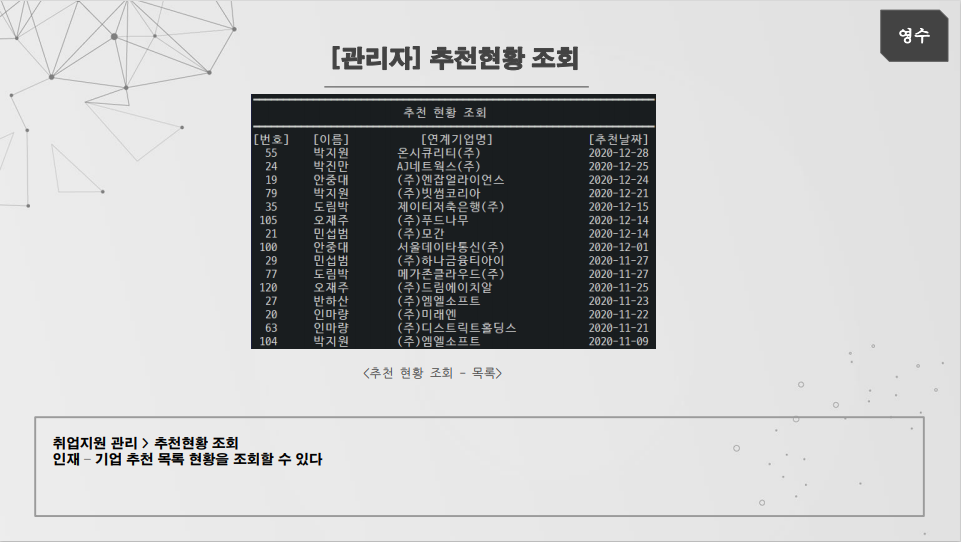
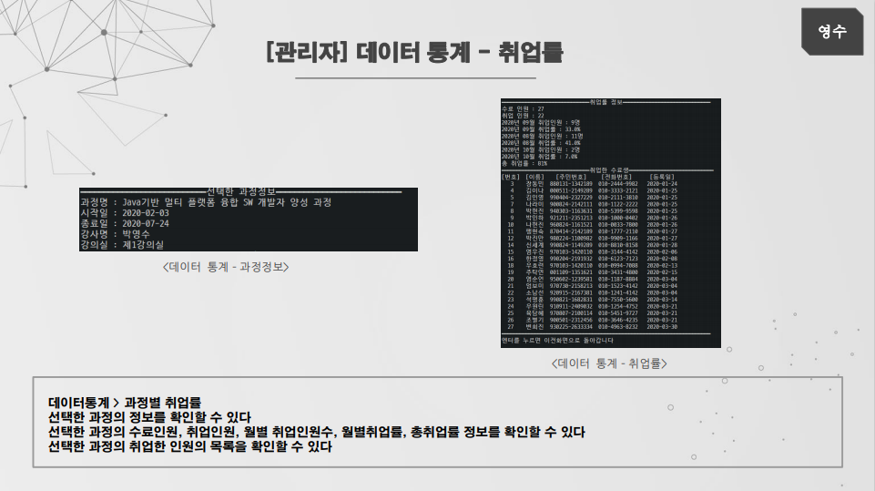

# SistProgram
 [Console Project] Team 3 : Sist Oracle Team Project

## 개발 환경

<table>
    <tr>
        <th>프로젝트명</th>
        <th>Sist Program</th>
        <th>개발 기간</th>
        <th>2020.12.03. ~ 2020.12.27</th>
    </tr>
    <tr>
        <th>프로젝트 개요</th>
        <th>쌍용 교육센터 관리 프로그램</th>
        <th>개발환경</th>
        <th>Windows 10</th>
    </tr>
    <tr>
        <th>개발언어</th>
        <th>Java(JDK 1.8)</th>
        <th>형상관리</th>
        <th>Github, Git Bash, Git Desktop</th>
    </tr>
    <tr>
        <th>개발도구</th>
        <th>Eclipse JEE, sqldeveloper</th>
        <th>사용기술</th>
        <th>Java, Oracle</th>
    </tr>
     <tr>
        <th>개발 인원</th>
        <th colspan="3">5명 : 박영수(팀장), 김소리, 신우철, 윤지현, 이현우 </th>
    </tr>
</table>

## 목적
Oracle 데이터베이스와 JDBC 를 사용해서 쌍용 교육센터에서 서비스하고 있는 모든 기능들을  
프로그램을 통해서 이용할 수 있도록 하기 위한 쌍용 교육센터 프로그램을 개발한다

## 데이터 구조 

## 담당한 업무
- [관리자] 학생 출결 관리
- [관리자] 취업 현황 조회
- [관리자] 연계기업 CRUD + 검색
- [관리자] 추천인재 CRUD + 검색, 인재추천하기
- [관리자] 데이터 통계 - 출석률, 수료율, 취업률

### 1. [관리자] 학생 출결 관리
---

  
  

  

### 2. [관리자] 취업 현황 조회
---

  
  

  
  

### 3. [관리자] 연계기업 CRUD + 검색
---

  
  

  
  

  
  

  

### 4. [관리자] 추천인재 CRUD + 검색, 인재추천하기
---

  
  

  
  

  
  

  
  

  
  

### 5. [관리자] 데이터 통계 - 출석률, 수료율, 취업률
---

  
  

  
  

## 후기
이번 프로젝트에서 아쉬운부분은 저번 프로젝트와 마찬가지로 초반 설계가 완벽하지 않아서 개발 진행하는 도중 몇번의 ERD 수정이 필요했다는 것,
DML 쿼리를 작성할때 JDBC에서 어떻게 동작하는지 모르는 상태로 작성해 놓아서 JDBC 개발에 들어갔을때 쿼리를 수정해야 하는 문제가 발생했다는 점,
그리고 팀장으로써 프로젝트 진행 상황 점검과 속도 조절에 실패해서 프로젝트의 마무리 부분에서 너무 급하게 진행됐다는 것 입니다
그래도 부족한 팀장을 조원들이 잘 따라와줘서 프로젝트를 무사히 마무리한것 같아 조원들에게 감사한 마음입니다.

